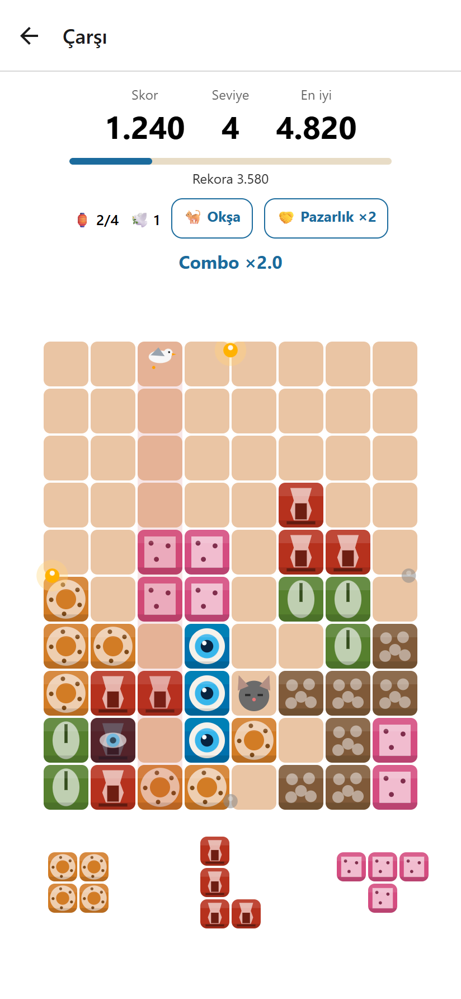
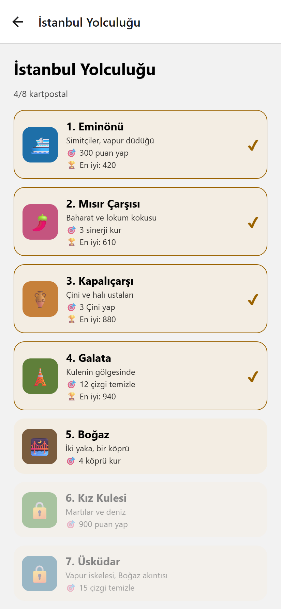
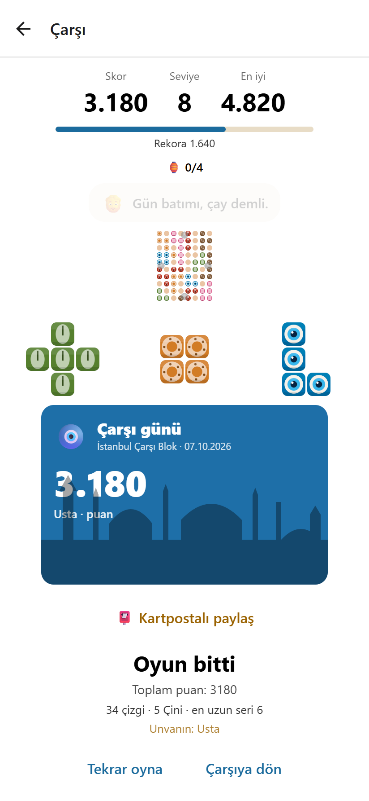
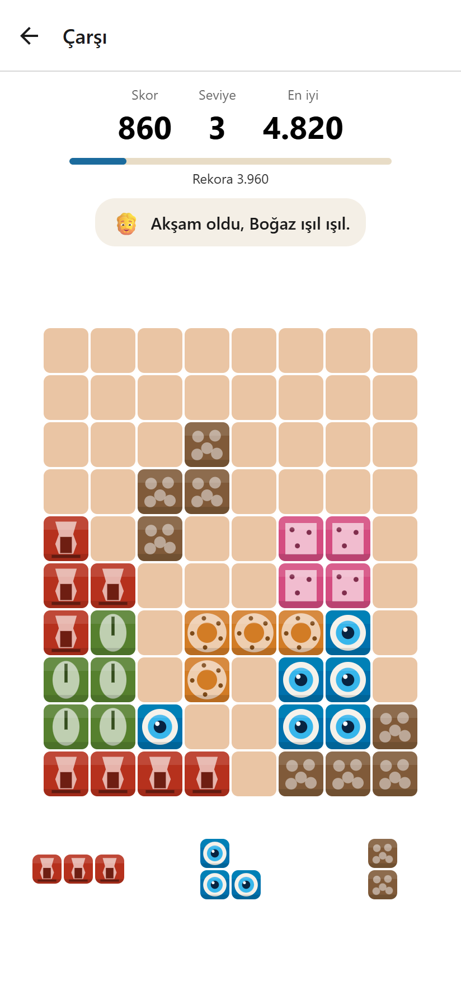
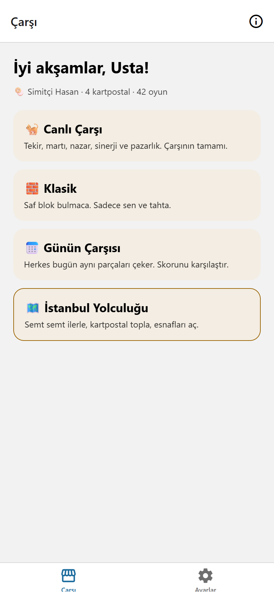
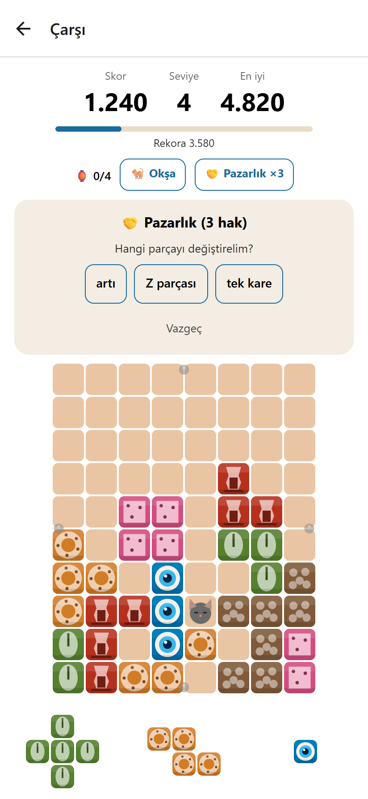
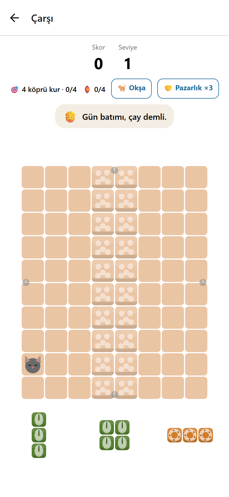
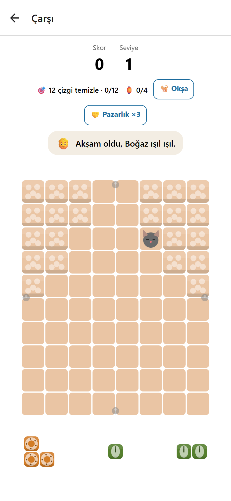
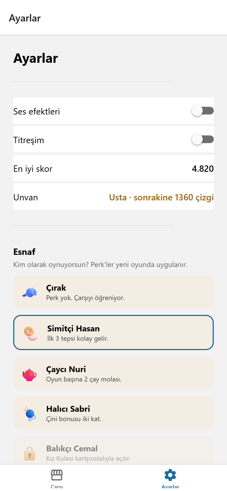

  

<h1 align="center">İstanbul Çarşı Blok</h1>

  <b>İstanbul'un çarşılarında geçen bir blok bulmaca oyunu.</b> 
  Simit, çay bardağı, nazar boncuğu, lokum, fıstık ve bakır. Hepsi birer blok.

  
  
  

---

## İçindekiler

- [Temel Oynanış](#temel-oynanış)
- [Bloklar: Çarşı Eşyaları](#bloklar-çarşı-eşyaları)
- [Oyun Modları](#oyun-modları)
- [Canlı Çarşı: Yaşayan Tahta](#canlı-çarşı-yaşayan-tahta)
- [Pazarlık ve Çay Molası](#pazarlık-ve-çay-molası)
- [İstanbul Yolculuğu](#istanbul-yolculuğu)
- [Esnaf Seçimi](#esnaf-seçimi)
- [Puanlama](#puanlama)
- [Oyun Sonu, Unvanlar ve Kartpostal](#oyun-sonu-unvanlar-ve-kartpostal)
- [İpuçları](#ipuçları)

---

## Temel Oynanış

Oyun **8 × 10**'luk bir tahtada oynanır.

1. Ekranın altındaki tepside her zaman **3 parça** bulunur.
2. Bir parçayı **sürükleyip** tahtada boş bir yere bırakırsın. Parçalar döndürülmez.
3. Bir **satır** ya da **sütun** tamamen dolunca temizlenir ve puan kazanırsın.
4. Aynı hamlede birden fazla çizgi temizlersen **combo** yaparsın. Arka arkaya temizlemeler **seri** oluşturur.
5. Üç parçanın üçü de yerleşince tepsi yenilenir.
6. Tepsideki parçaların **hiçbiri** tahtaya sığmıyorsa oyun biter.

Ekranın üstünde anlık skor, seviye ve en iyi skorun durur. Altındaki **rekor çubuğu** "Rekora N kaldı" diyerek seni zorlar. Çarşının esnafı sıradan hamlelerde susar. Rekor, Çini ya da büyük bir combo gibi anlarda konuşur.

 

## Bloklar: Çarşı Eşyaları

Her renk bir çarşı eşyasıdır. Oyunun tüm çizimleri vektördür (Skia), resim dosyası kullanılmaz.

| Eşya          | Rolü                                                          |
| ------------- | ------------------------------------------------------------- |
| 🥯 **Simit**  | Martıyı doyurur. Simit + çay yan yana: **kahvaltı sinerjisi** |
| 🍵 **Çay**    | Kahvaltı sinerjisinin diğer yarısı                            |
| 🧿 **Nazar**  | Komşu hücreleri nazardan **korur**                            |
| 🍬 **Lokum**  | Lokum + fıstık yan yana: **sinerji**                          |
| 🥜 **Fıstık** | Lokumun eşi                                                   |
| 🟫 **Bakır**  | Dövme bakır. Saf renk, Çini kurmak için iyi                   |

**Çini bonusu:** Bir çizgiyi **tek renkle** doldurup temizlersen **+50** puan alırsın. Tepsideki parçalar çoğu zaman bir öncekinin rengini taşır, bu yüzden Çini kurmak planlanabilir.

## Oyun Modları

Ana ekran günün saatine göre seni selamlar ("Günaydın", "İyi akşamlar"), unvanını ve kaç kartpostal topladığını gösterir.

| Mod                       | Açıklama                                                                         |
| ------------------------- | -------------------------------------------------------------------------------- |
| 🐈 **Canlı Çarşı**        | Çarşının tamamı: Tekir, martı, nazar, sinerji, kapılar ve pazarlık               |
| 🧱 **Klasik**             | Saf blok bulmaca. Sadece sen ve tahta                                            |
| 📅 **Günün Çarşısı**      | Herkes o gün **aynı parçaları** çeker. Skorunu karşılaştır. Günlük rekor tutulur |
| 🗺️ **İstanbul Yolculuğu** | Semt semt ilerle, hedefleri tamamla, kartpostal topla                            |

Yarıda kalan oyun kaydedilir. Ana ekrandaki **▶ Devam et** kartıyla kaldığın yerden sürdürürsün.

 

## Canlı Çarşı: Yaşayan Tahta

Canlı Çarşı'da tahta ölü bir ızgara değil, yaşayan bir yerdir.

### 🐈 Tekir

- Tahtada bir hücrede **uyur**. O hücreye parça konamaz.
- Bitişiğindeki bir çizgi temizlenince **yer değiştirir**.
- **Okşa** düğmesine basınca 3 hamle boyunca yerinden kalkmaz.
- **Her 3. okşamada** teşekkür olarak 3 rastgele dolu hücreyi boşaltır. Kedi engel değil, bakılırsa yardımcıdır.

### 🕊️ Martı

- **12 hamlede bir** bir sütunun üstüne konar.
- **2 hamle sonra** dalar ve o sütundaki en üstteki dolu hücreyi **çalar**.
- Sütununa **simit** koyarsan karnını doyurur, **+30** puan verir ve gider.

### 🧿 Nazar

- Nadiren bir hücre **kararır** (nazar değer).
- **6 hamle** içinde o hücreyi temizlemezsen nazar **komşu hücreye yayılır**.
- **Nazar boncuğu** bloğu komşularını korur.
- Nazarlı hücreyi temizlemek **+60** puan.

### 🏮 Kapılar ve Çarşı Şenliği

Tahtanın dört kenar çizgisi (üst, alt, sol, sağ) birer kapıdır. Bir kenar çizgisini temizleyince o kapının **feneri yanar** (HUD'da `2/4` gibi görünür). Dört fener de yanınca **Çarşı Şenliği** başlar: **3 hamle boyunca puanlar ×2**.

### 🍵 Sinerji

Temizlenen çizgide yan yana duran **simit + çay** ("kahvaltı") ya da **lokum + fıstık** çiftleri her biri **+40** puan getirir.

### 🎵 Makam serisi

Arka arkaya her temizleme, **Nihavend makamının** bir sonraki notasını çalar. 8 notayı tamamlarsan "makam tamamlandı" ve **+100** puan.

 

## Pazarlık ve Çay Molası

### 🤝 Pazarlık

İşine yaramayan bir parçan mı var? Esnafla pazarlık et.

- Oyun başına **3 hak** vardır.
- Değiştirmek istediğin parçayı seç ("artı", "Z parçası", "tek kare"…).
- Kayan ibreyi **yeşil bölgede** durdur.
- Tutturursan parça **bedava** değişir. Kaçırırsan **−30** puan.

### ☕ Çay Molası

Sıkıştın ve oyun bitti mi? Oyun başına **1 ücretsiz devam** hakkın var. Çay molası tahtanın **en dolu 2 satırını ve 2 sütununu** boşaltır ve oyuna devam edersin.

Benzer oyunlar bunu reklam izletip satıyor. Burada bedava.

 

## İstanbul Yolculuğu

Yolculuk, İstanbul'u semt semt gezdiren hedefli bir moddur. Her semtin **kendi hedefi** vardır. Hedefi tamamlayınca o semtin **kartpostalı** koleksiyonuna eklenir ve bir sonraki semtin kilidi açılır.

| #   | Semt                 | Hedef            | Özellik                                                        |
| --- | -------------------- | ---------------- | -------------------------------------------------------------- |
| 1   | ⛴️ **Eminönü**       | 300 puan yap     | Isınma turu                                                    |
| 2   | 🌶️ **Mısır Çarşısı** | 3 sinerji kur    | Sinerjiler açık                                                |
| 3   | 🏺 **Kapalıçarşı**   | 3 Çini yap       | Kapılar ve Şenlik açık                                         |
| 4   | 🗼 **Galata**        | 12 çizgi temizle | **Galata Kulesi silueti** şeklinde tahta                       |
| 5   | 🌉 **Boğaz**         | 4 köprü kur      | Ortadan **su şeridi** geçer. Suyu aşan satır = **Köprü** (+50) |
| 6   | 🕊️ **Kız Kulesi**    | 900 puan yap     | Şekilli tahta, martılar 8 hamlede bir gelir                    |
| 7   | ⛵ **Üsküdar**       | 15 çizgi temizle | **Boğaz akıntısı:** her 5 hamlede satırlar bir hücre kayar     |
| 8   | 🐈 **Kadıköy**       | 25 çizgi temizle | Final: kedi, nazar, sinerji, kapılar hepsi bir arada           |

Her semtin kendi rekoru tutulur. Hedefli seviyeler genel rekorunu etkilemez.

 

### Şekilli tahtalar

  
  &nbsp;&nbsp;
  

<i>Solda Boğaz (ortada su şeridi, karşıya köprü kur), sağda Galata (kule silueti tahta).</i>

## Esnaf Seçimi

Ayarlar ekranından **kimin olarak oynayacağını** seçersin. Her esnafın kendine özgü bir avantajı (perk) vardır. Yeni esnaflar Yolculuk'ta kartpostal kazandıkça açılır.

| Esnaf                | Avantaj                            | Nasıl açılır            |
| -------------------- | ---------------------------------- | ----------------------- |
| 🧢 **Çırak**         | Avantaj yok, çarşıyı öğreniyor     | Baştan açık             |
| 🥯 **Simitçi Hasan** | İlk 3 tepsi kolay gelir            | Eminönü kartpostalı     |
| 🫖 **Çaycı Nuri**    | Oyun başına **2** çay molası       | Kapalıçarşı kartpostalı |
| 🧶 **Halıcı Sabri**  | Çini bonusu **iki kat**            | Galata kartpostalı      |
| 🐟 **Balıkçı Cemal** | Martı sık gelir, simit **×2** puan | Kız Kulesi kartpostalı  |

Ses efektleri ve titreşim de aynı ekrandan açılıp kapatılır.

 

## Puanlama

| Olay                                        | Puan                                  |
| ------------------------------------------- | ------------------------------------- |
| Temizlenen her çizgi                        | Taban puan, combo ve seriyle katlanır |
| **Çini** (tek renkli çizgi)                 | **+50**                               |
| **Sinerji** çifti (simit+çay, lokum+fıstık) | **+40** / çift                        |
| Martıyı simitle doyurmak                    | **+30**                               |
| Nazarlı hücreyi temizlemek                  | **+60**                               |
| **Köprü** (Boğaz'da suyu aşan satır)        | **+50**                               |
| Makam tamamlamak (8 ardışık temizleme)      | **+100**                              |
| **Çarşı Şenliği** (4 fener)                 | 3 hamle boyunca **×2**                |
| Pazarlığı kaçırmak                          | **−30**                               |

Puan arttıkça **seviye** yükselir.

## Oyun Sonu, Unvanlar ve Kartpostal

Oyun bittiğinde bir **özet** görürsün: toplam puan, temizlenen çizgi, Çini sayısı, en uzun seri ve unvanın.

### Unvanlar

Ömür boyu temizlediğin çizgi sayısı unvanını belirler:

**Çırak** → **Kalfa** (100 çizgi) → **Usta** (500 çizgi) → **Hacı** (2000 çizgi)

### 📮 Kartpostal

Her oyunun sonunda skorun, unvanın ve **İstanbul silueti** ile bir kartpostal hazırlanır. **Kartpostalı paylaş** ile arkadaşlarına gönderebilirsin.

### Bir Gün İstanbul ve takvim

- Tahta zemini ve esnafın karşılaması **telefonunun saatine** göre değişir (sabah, gün, akşam, gece).
- **Ramazan**'da iftardan sonra ek çay molası verilir (İstanbul gün batımı hesaplanır). **Bayramlar**, **29 Ekim** ve **yılbaşı** için özel etkinlikler de vardır.

 

## İpuçları

- **Köşeleri boş bırakma.** Büyük parçalar (artı, kare, L) için ortada yer aç.
- **Renk biriktir.** Tepsideki parçalar çoğu zaman aynı rengi taşır. Bir çizgiyi tek renkle doldurup Çini yap.
- **Martıya simit hazırla.** Martının konduğu sütuna simit koymak hem puan getirir hem de bloğunun çalınmasını önler.
- **Nazar boncuğunu stratejik koy.** Komşularını korur, nazarın yayılmasını keser.
- **Kediyi okşa.** Üç okşamada bir tahtandan 3 blok temizler.
- **Kenarları hedefle.** Dört kenar çizgisi Şenlik'i başlatır. Puanı ikiye katlamak için büyük combo'yu Şenlik'e sakla.
- **Çay molasını erken harcama.** Oyunun tek kurtarma hakkı o.

---

  Expo + React Native Skia + Reanimated ile geliştirildi. Hedef platform: Google Play. 
  Bu sayfadaki görseller oyunun kendisinden alınmış ekran görüntüleridir. Geliştirici notları için <a href="README.md">README</a>.

